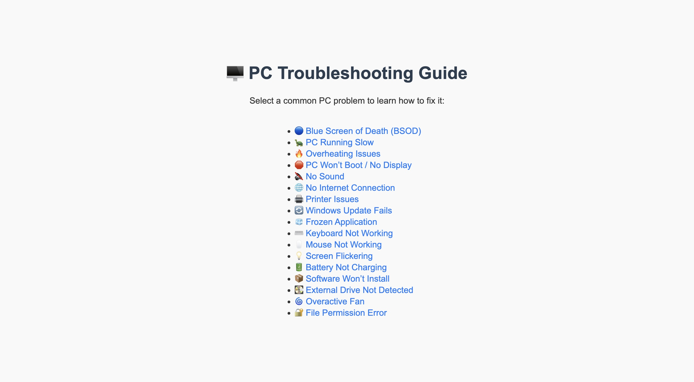
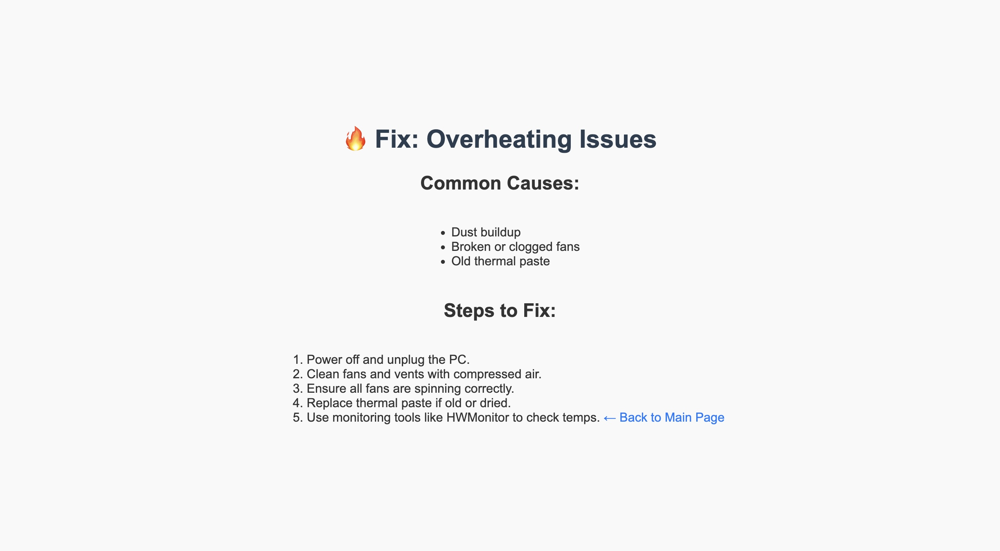

# 🖥️ PC Troubleshooting Guide

A simple HTML/CSS-based guide to common PC issues and how to resolve them. Created as a reference tool and study aid for the CompTIA A+ Certification.

---

## 💡 Features

- Step-by-step solutions for common PC problems  
- Easy-to-navigate layout using internal links  
- Clean, responsive design with CSS  
- Ideal for beginners and IT support learners

---

## 📸 Screenshots

### Homepage


### Overheating Troubleshooting Page


---

## 🧩 Technologies Used

- HTML5  
- CSS3  

---

## 📂 File Structure

```
pc-troubleshoot-guide/
├── index.html                      # Main index page with links to all troubleshooting guides
├── style.css                       # Shared stylesheet
├── battery-not-charging.html
├── bsod.html
├── external-drive-not-detected.html
├── file-permission-error.html
├── frozen-app.html
├── keyboard-not-working.html
├── mouse-not-working.html
├── no-boot.html
├── no-internet.html
├── no-sound.html
├── overactive-fan.html
├── overheating.html
├── printer-issues.html
├── screen-flickering.html
├── slow.html
├── software-wont-install.html
├── windows-update-fail.html
│__ images/
      ├── screenshot-home.png
      └── screenshot-overheat.png
```


---

## 🚀 How to Use

1. Clone or download the repository  
2. Open `index.html` in your browser  
3. Click through any issue to find a troubleshooting solution  

---

## 🧠 Purpose

This project was built to:
- Help users resolve basic PC problems
- Serve as a personal reference tool
- Support CompTIA A+ exam preparation

---

## 📜 License

This project is licensed under the [MIT License](LICENSE).
